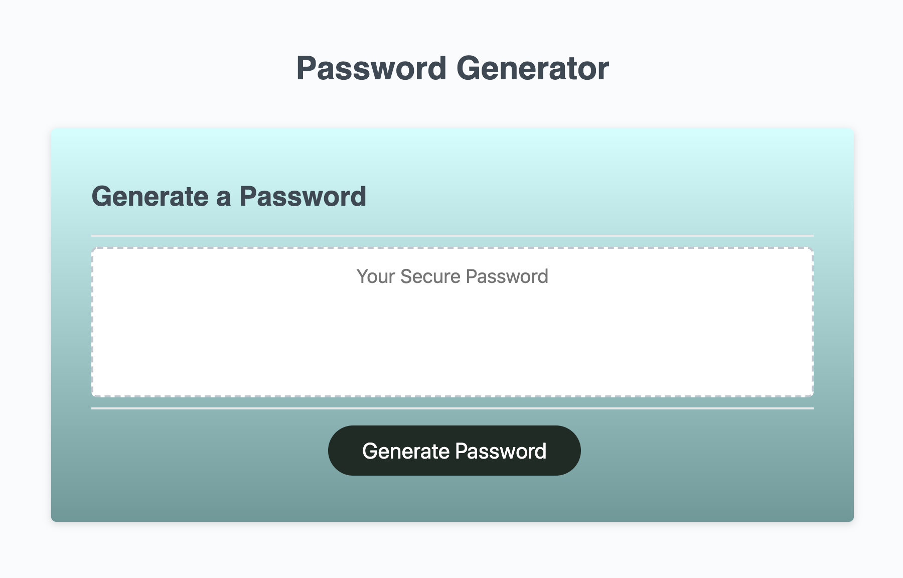
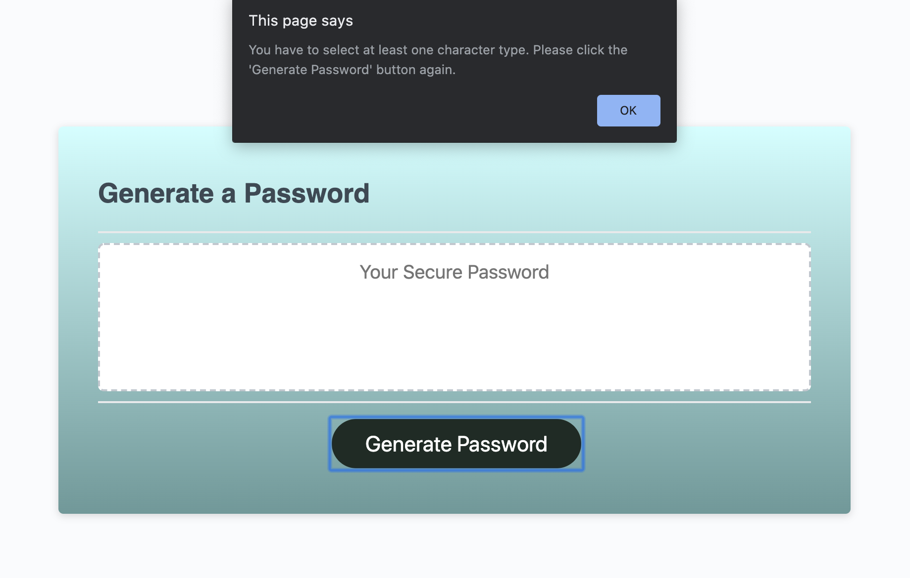
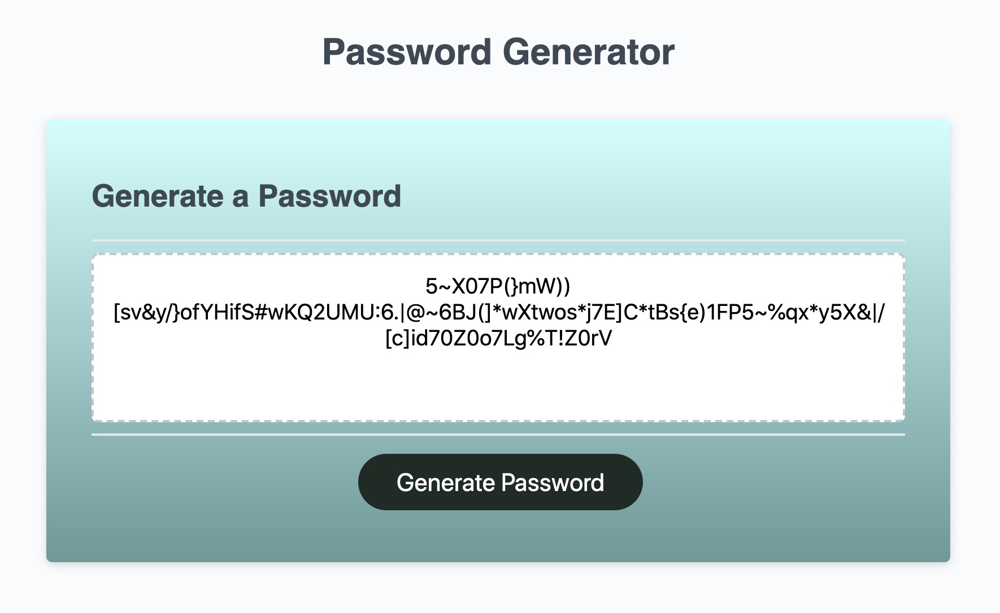

# Password Generator

```
This code will generate a secure password based on user's chosen criteria.
```

When the user clicks the 'Generate Password' button,
The user will be presented with a series of prompts for password criteria:

* Length of the password
* User is only allowed to enter between 8 and 128 characters
* If the user enters a number lower than 8 or greater than 128, the prompt will re-appear

* Next, user will be asked for character types:
* Lowercase, Uppercase, Numeric, and/or Special Characters
* User has to choose at least one character type
* If the user did not choose at least one character type, an alert will appear asking the user to start over and click the Generate Password button again

* When all prompts are answered, and at least one character type is selected
* Then a password is generated that matches the selected criteria
* The password is then written to the page





Deployed Application: https://xtineroq.github.io/password-generator/
